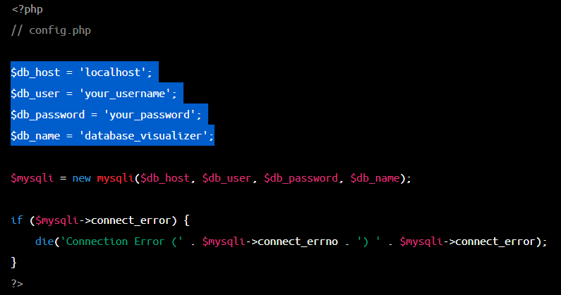
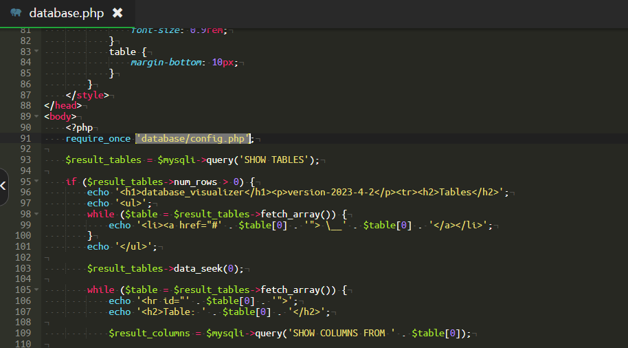
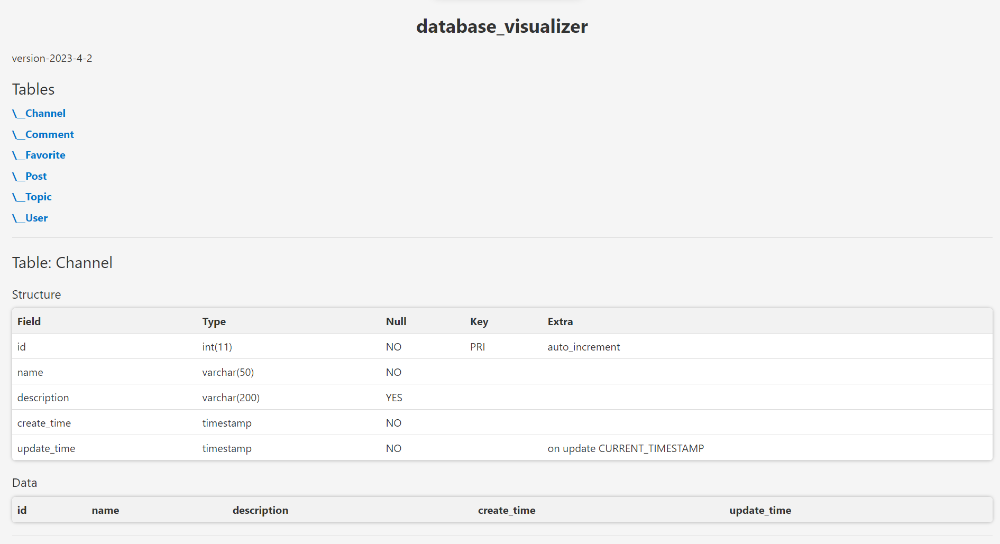

# **[database_visualizer](https://github.com/Qingbolan/database_visualizer)**

> 2023-4-3

## purpose

This project involves building a PHP web page that allows for the visualization of a database's structure and contents. The page will have a simple, matte texture design style.

## accomplishment

To accomplish this, we will first need to connect to the database using PHP functions and retrieve the table structure and content. We can use the mysqli functions to accomplish this, including the `mysqli_connect()`, `mysqli_query()`, and `mysqli_fetch_assoc()` functions.

Once we have the necessary data, we will need to create a visualization page using HTML, CSS, and JavaScript. We can create a simple layout with a sidebar for displaying the table structure and a main content area for displaying the table contents. To achieve the matte texture design style, we can use CSS3 gradient and shadow effects, along with some simple icons and buttons.

In the content area, we can use PHP code to dynamically generate the table structure and content. We can use `foreach` loops to iterate over the tables and table content, and use HTML tables to display the data.

Finally, we will need to run the PHP page on a web server and connect it to the database. We can use Apache or Nginx as a web server to run the PHP web page.

Overall, this project will involve using PHP, HTML, CSS, and JavaScript to create a visually appealing and functional web page for visualizing a database's structure and contents.

## establish

- set up your database infos

  

- edit the relative direction of `config.php`

  

## demo

- miec.qingbolan.net/database.php

